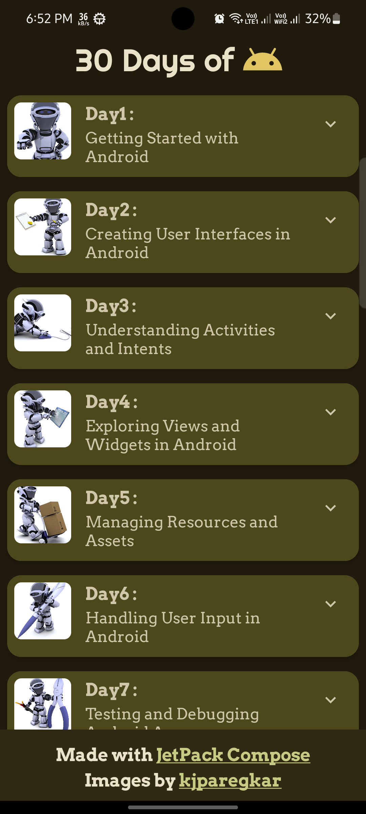
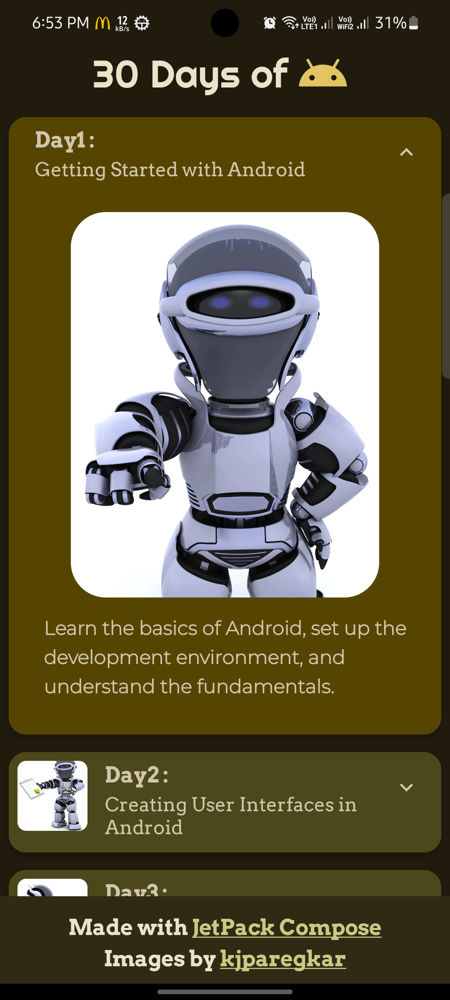
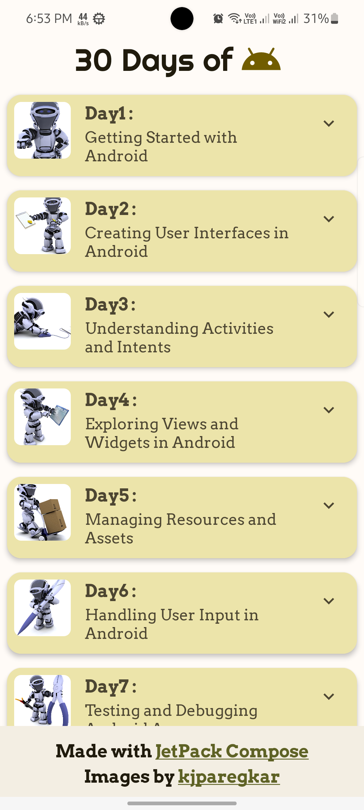
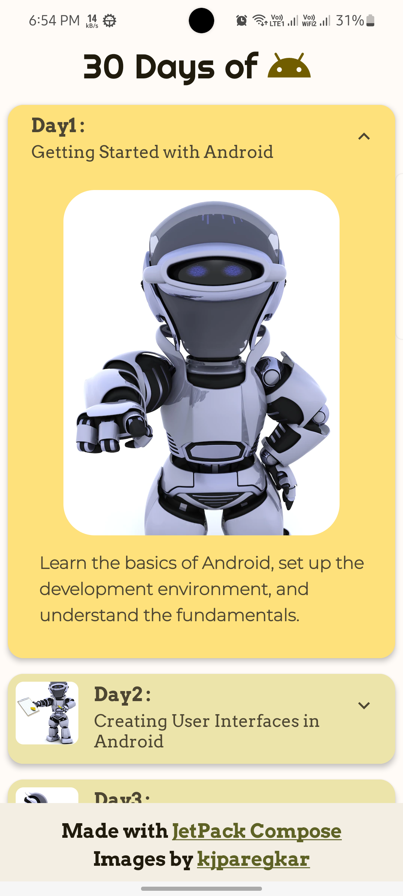

# 30 Days of Android

30 Days of Android is an Android application designed to guide you through a 30-day journey of learning and mastering Android app development. This app provides a structured curriculum with daily topics to help you build your Android development skills, understand key concepts, and create real-world Android applications. Whether you're a beginner or an experienced developer, 30 Days of Android offers a comprehensive learning experience to enhance your proficiency in Android development.

## Features

- **30-Day Curriculum:** Engage in a curated 30-day learning journey with daily topics.
- **Daily Topics:** Explore a new Android development topic every day, covering various aspects of Android app development.
- **Real-World Projects:** Apply your knowledge to build real-world Android applications.

## Screenshots

  
  
  
  

## Installation

1. Download the APK file from the [releases](https://github.com/Indresh10/AndroMonth/releases) section of this repository.
2. Transfer the APK file to your Android device.
3. On your Android device, navigate to **Settings > Security** and enable **Unknown sources** to allow the installation of apps from sources other than the Play Store.
4. Use a file manager app to locate the APK file and tap on it to begin the installation.
5. Follow the on-screen instructions to install the 30 Days of Android app on your device.
6. Once installed, you can find the app icon on your home screen or app drawer.

## Usage

1. Launch the 30 Days of Android app by tapping on its icon.
2. Start your 30-day journey by accessing the first-day topic.
3. Read the topic description.
4. Use your preferred development environment (e.g., Android Studio) to experiment with the concepts discussed.
5. Repeat the process for each subsequent day's topic.

## Contributing

Contributions to 30 Days of Android are welcome! If you find any issues, have suggestions, or would like to add new features, please feel free to submit a pull request.

## Acknowledgments

We would like to thank the following resources and individuals for their contributions to 30 Days of Android:

- [Images](https://www.freepik.com/author/kjpargeter) by Kjpargeter
